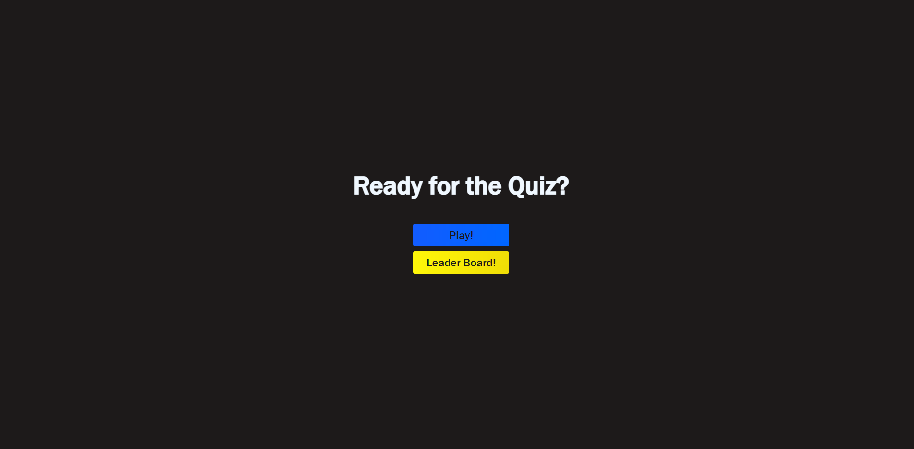

# John Kang, Challenge 4; Creating a Quiz
The purpose of this assignment was to creat a quiz using HTML, CSS, and JavaScript. The quiz features a timer that will decrement when the wrong answer is chosen. The quiz also features a high score page so the user can save their highest scores. It will store up to 5 highscores. 

## Screenshot of deployed website

### Deployed Site
